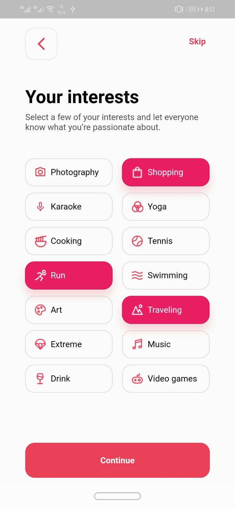
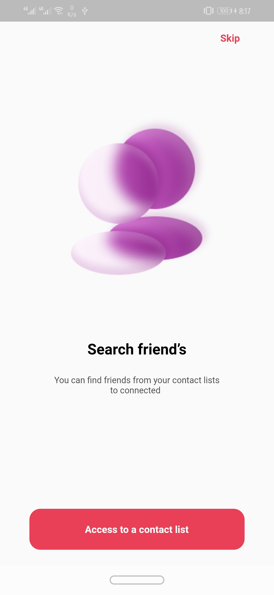
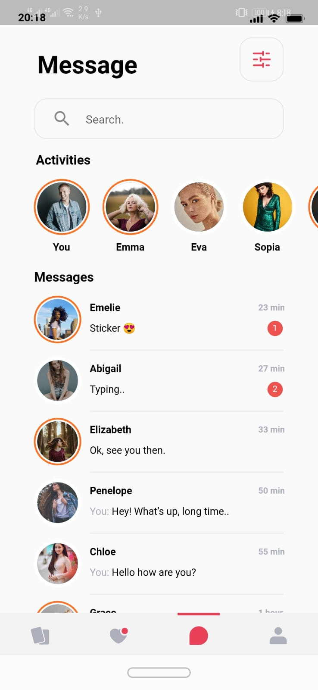
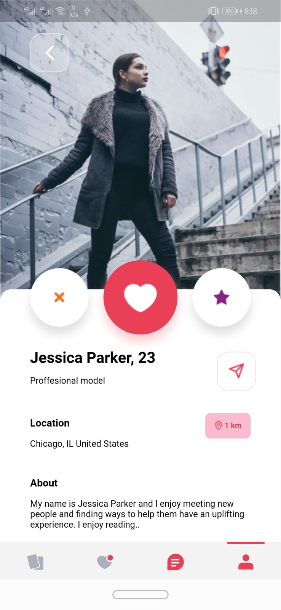
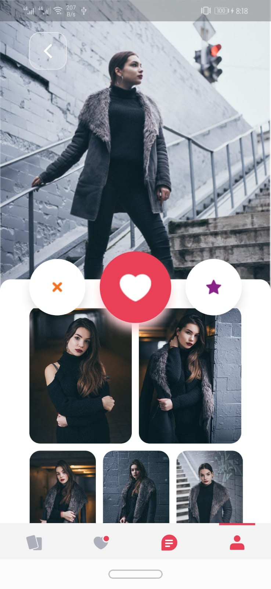

# konko_maji

A new Flutter project.

## Getting Started

This project is a starting point for a Flutter application.

A few resources to get you started if this is your first Flutter project:

- [Lab: Write your first Flutter app](https://docs.flutter.dev/get-started/codelab)
- [Cookbook: Useful Flutter samples](https://docs.flutter.dev/cookbook)

For help getting started with Flutter development, view the
[online documentation](https://docs.flutter.dev/), which offers tutorials,
samples, guidance on mobile development, and a full API reference.

## Features

- **Custom UI Elements**: Recreated bKash's user interface with attention to detail.
- **Asset Challenges**: Overcame difficulties in finding suitable assets, utilizing open-source resources, and creating custom assets.
- **Drawer and Navigation Bar Customization**: Customized the app's drawer and navigation bar to match bKash's layout.
- **Custom Button Animation**: Implemented complex animations for custom buttons, ensuring a smooth user experience.
- **Balance Display**: Created a visually appealing animation to display the user's balance.

## Final Output
|  |  |  |  |  |
|:----------------------:|:----------------------:|:----------------------:|:----------------------:|:----------------------:|

[Watch Full Demo on YouTube]()

